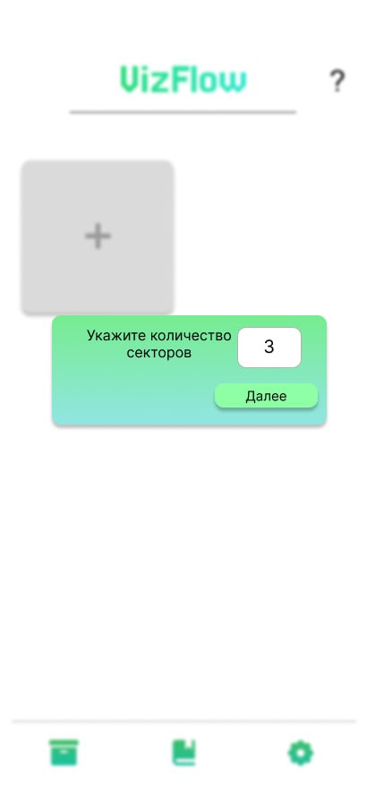

VizFlow - Приложение для OC Аврора
===

Описание
---

**VizFlow** – это удобное приложение для анализа данных и построения графиков (дашборд), которое визуализирует информацию в виде одного из трех доступных типов графиков: гистограммы, круговой диаграммы или графика корреляции.
Для создания графика достаточно ввести название и выбрать тип графика, после чего можно указать источник данных. Система поддерживает ручной ввод данных (до 10 пар) для каждого типа диаграмм или же загрузку файла формата .xlsx, что позволяет быстро получить необходимую визуализацию.

**Гистограмма** строится на основе данных, которые могут быть введены вручную или загружены из файла. Вы можете задать названия осей и количество столбцов, а также ввести значения, по которым будет построена гистограмма.

**Круговая диаграмма** также может быть создана как вручную, так и с использованием загруженного файла. При ручном вводе нужно указать количество секторов и соответствующие значения.

**График корреляции** позволяет пользователю визуализировать взаимосвязь между двумя переменными. Пользователь задает названия осей и координаты точек, что обеспечит точное представление зависимости.

Система автоматически строит по полученным данным графики, диаграммы, гистограммы и тд. Также реализована возможность сохранять графики в PNG и PDF форматах.

Функционал
---

1. **Визуализация:** Приложение позволяет, используя имеющиеся данные, визуализировать данные по различным метрикам для поиска закономерностей, зависимостей и анализа.
2. **Работа с данными:** Пользователь может сортировать или фильровать свои данные для дальнейшего пользования.
3. **Сохранение результата:** Пользователь, после работы с приложением, может сохранять результат в виде графиков в форматах PNG и PDF.
4. To be continued...

Технологии
---

1. **Flutter** - Кросс-платформенный фреймворк для разработки пользовательского интерфейса.
2. **Dart** - Язык программирования, используемый во Flutter.
3. **AuroraSDK** - Плагин для разработки приложения для ОС Аврора.

Галерея
---

|  |  |
|:-------------------:|:-------------------:|
|  |  |
|  |  |
|  |  |
|  |  |
|  |  |
|  |  |
|  |                     |

Команда разработчиков
---

1. Ерохина Дарья. 
2. Шмыров Артем.
3. Скуратов Даниил.
4. Ивановский Семен.
